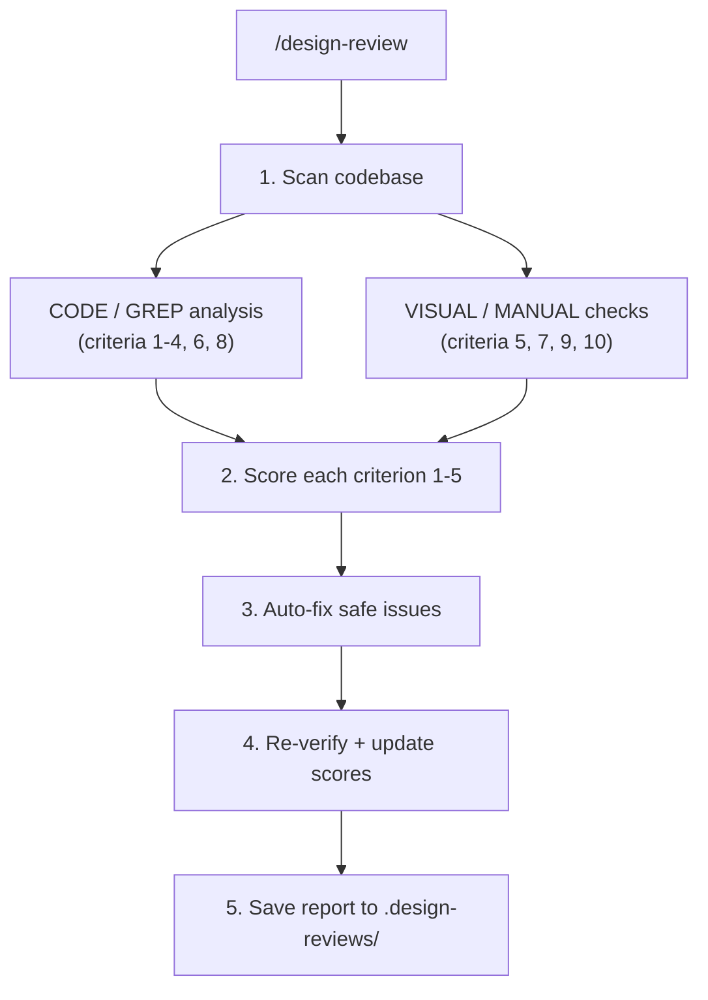
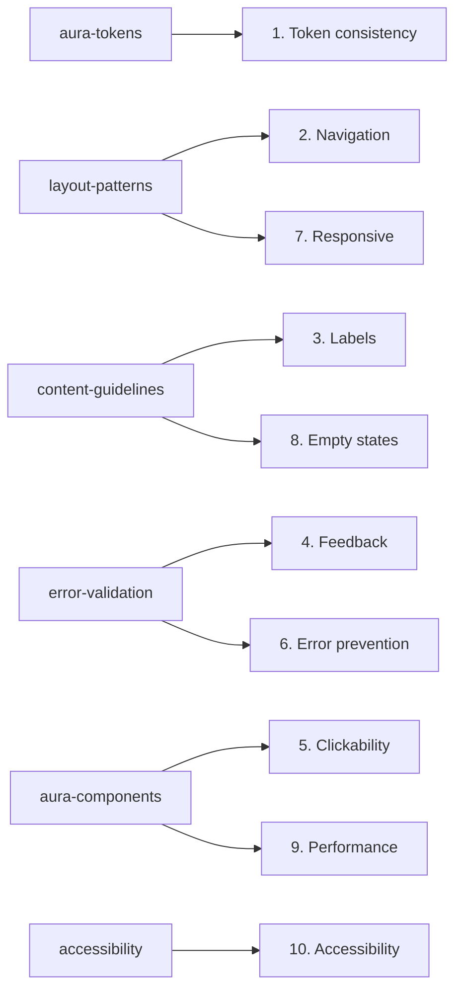

# Design Skills

AI-powered guardrails for building frontend applications with the [Aura design system](https://cognitedata.github.io/aura/storybook/). One entry point: `/design-review` scores built apps against Aura standards.

## Quick Start

**After development (quality review):**
1. Open an existing React + Tailwind + Aura app in Cursor
2. Type `/design-review` to run a full quality assessment

Skills also activate automatically as you code — modify a style and **aura-tokens** kicks in, create a form and **error-validation** guides you.

## Skills at a Glance

Six skills activate during development. One entry point orchestrates the review.

### Build-time Skills

These activate automatically when the AI detects relevant work:

| Skill | What it does | Activates when... |
|-------|-------------|-------------------|
| [aura-tokens](../skills/design/aura-tokens/SKILL.md) | Enforces semantic design tokens, prevents hardcoded values | Writing or modifying styles |
| [aura-components](../skills/design/aura-components/SKILL.md) | Guides Aura component selection, prevents custom rebuilds | Creating interactive UI |
| [layout-patterns](../skills/design/layout-patterns/SKILL.md) | Provides approved page layouts with responsive specs | Creating or restructuring pages |
| [content-guidelines](../skills/design/content-guidelines/SKILL.md) | UX writing standards, text patterns, voice and tone | Writing user-facing text |
| [accessibility](../skills/design/accessibility/SKILL.md) | Keyboard nav, ARIA, focus management, alt text | Building interactive elements |
| [error-validation](../skills/design/error-validation/SKILL.md) | Form validation, loading states, error handling | Building forms or handling API responses |

### Codebase Entry Point

| Skill | What it does | Activates when... |
|-------|-------------|-------------------|
| [design-quality-checklist](../skills/design/design-quality-checklist/SKILL.md) | Scores the app against 10 criteria using all skills above | Running `/design-review` |

## The `/design-review` Command

Runs a comprehensive quality review with a closed-loop auto-fix workflow. The review scans your codebase against 10 criteria, scores each 1-5, auto-fixes what it can, re-verifies, and generates a report with before/after comparisons. Scores are tracked over time so you can see improvement across reviews.

For the full command definition, see [commands/design-review.md](commands/design-review.md).

### How It Works



### What Each Skill Checks

The **design-quality-checklist** cross-references all six build-time skills during the review. Each skill feeds specific criteria:



### The 10 Criteria

| # | Criterion | What it checks |
|---|-----------|---------------|
| 1 | Aura token consistency | Hardcoded colors, Tailwind defaults, non-Aura imports |
| 2 | Navigation and hierarchy | Heading structure, breadcrumbs, panel collapsibility |
| 3 | Labels and language | Generic labels, sentence case, UX writing quality |
| 4 | Feedback and validation | Loading states, error messages, form validation |
| 5 | Clickability | Button usage, hover states, interactive affordances |
| 6 | Error prevention | Destructive action confirmations, cancel options |
| 7 | Responsive design | Breakpoint behavior, touch targets, overflow handling |
| 8 | Empty states | Data components with no-data handling and CTAs |
| 9 | Performance | Skeleton loading, click efficiency, bulk actions |
| 10 | Accessibility | Keyboard nav, ARIA attributes, contrast, focus management |

### Example Report Output

```markdown
## Design Review Report
Date: 2024-03-01 | Score: 4.2/5.0 (Good) | Improvement: +1.0 from last review

### Visual Review Metadata
- Dark mode tested: yes (via theme toggle button)
- Viewports tested: desktop, tablet, mobile
- Screenshots captured: 12

### Priority Fixes (3)
1. [CODE+VISUAL] Button hover states missing in dark theme
   -> Add hover:bg-primary-hover to Button.tsx:L45

2. [VISUAL] Mobile navigation menu not keyboard accessible
   -> Verify focus trapping implementation

3. [PATTERN] text-muted-foreground/50 opacity violations (15 instances)
   -> Remove opacity modifiers on readable text
```

## Scoring Scale

Each criterion is scored 1-5. The overall score is the average across all 10.

| Score | Level | What it means |
|-------|-------|--------------|
| 4.5 - 5.0 | Excellent | Ready to launch |
| 3.8 - 4.4 | Good | Launch with minor fixes |
| 3.0 - 3.7 | Average | Fix major issues before launch |
| Below 3.0 | Needs work | Focus on lowest scores first |

## Finding Types

Every finding in the report is tagged so you know how it was verified:

| Tag | Meaning | Auto-fixable? |
|-----|---------|---------------|
| `[CODE]` | Verified by reading source code (file + line) | Yes, if safe |
| `[GREP]` | Verified by automated pattern search | Yes, if safe |
| `[VISUAL]` | Verified by browser screenshot or interaction | No |
| `[MANUAL]` | Requires human visual/interaction check | No |
| `[PATTERN]` | Grouped violation appearing in 3+ files | Yes, if safe |
| `[CODE+VISUAL]` | Code finding confirmed by visual evidence | Yes (code portion) |

## Installation

### Prerequisites

- Cursor IDE with AI features enabled

### Option 1: Pull via CLI

```bash
npx @cognite/dune skills pull
```

### Option 2: Symlink Skills Globally

If you want these skills available in any project:

```bash
# Run from dune-skills/
for skill in skills/design/*/; do
  name=$(basename "$skill")
  [ "$name" = "shared" ] && continue
  ln -sf "$(cd "$skill" && pwd)" "$HOME/.cursor/skills/$name"
done
```

### Add the `/design-review` Rule to a Project

```bash
# Run from the target project root
mkdir -p .cursor/rules
ln -sf /path/to/dune-skills/design/tool-configs/cursor/design-review.mdc .cursor/rules/design-review.mdc
```

### Claude Code Setup

```bash
# Run from the target project root
mkdir -p .claude/commands
ln -sf /path/to/dune-skills/design/tool-configs/claude-code/design-review.md .claude/commands/design-review.md
```

Then use `/design-review` in Claude Code to trigger the review.

## What Gets Created

After running `/design-review`, your project will contain:

```
your-project/
├── .design-reviews/
│   ├── history.json                 # Score tracking across reviews
│   ├── 2024-03-01_review.md        # Latest full report
│   ├── 2024-02-15_review.md        # Previous reports
│   └── screenshots/                 # Visual evidence (last 3 reviews)
│       ├── login-desktop-light.png
│       ├── login-mobile-dark.png
│       └── dashboard-tablet-light.png
├── src/ (your code)
└── .gitignore                      # Consider adding .design-reviews/
```

## Limitations

- **Visual verification** requires a development server running on localhost
- **Dark mode testing** depends on a discoverable theme toggle or DOM attributes
- **Screenshot capture** limited to 20 images per review for storage efficiency
- **Browser automation** may not work in all development environments
- **Component verification** assumes standard Aura component imports
- **Responsive testing** covers common breakpoints (375px, 768px, 1440px) only
- **Auto-fix** excludes VISUAL-only findings (require manual verification)

## FAQ

**How long does a review take?**
Typically 2-5 minutes for code analysis. Add 3-5 minutes if visual verification runs with a dev server.

**Do I need a running dev server?**
No. Code-level analysis works without one. Visual verification (screenshots, interaction testing) requires a dev server on localhost. Criteria 5, 7, 9, 10 will be marked "(code-level only)" without it.

**Can I run it on part of a codebase?**
The review scans the entire project where the command is triggered. For partial reviews, open just the relevant subdirectory as a workspace.

**What if I don't use all Aura components yet?**
The review still works. It flags non-Aura components and scores accordingly. Use the auto-fix suggestions to migrate incrementally.

**Can I customize the scoring thresholds?**
Not currently. Thresholds are defined in the [design-quality-checklist](../skills/design/design-quality-checklist/SKILL.md) rubrics. You can fork and adjust for your team's standards.

## File Structure

```
dune-skills/
├── skills/
│   ├── design/
│   │   ├── accessibility/
│   │   │   └── SKILL.md               # Keyboard nav, ARIA, focus management
│   │   ├── aura-components/
│   │   │   └── SKILL.md               # Component selection, import guidance
│   │   ├── aura-tokens/
│   │   │   └── SKILL.md               # Design token enforcement
│   │   ├── content-guidelines/
│   │   │   ├── SKILL.md               # UX writing standards
│   │   │   ├── docs/                  # Figma MCP integration guides
│   │   │   ├── examples/              # Before/after UX text improvements
│   │   │   ├── references/            # Voice chart, audience, checklist
│   │   │   └── templates/             # Error, empty state, onboarding
│   │   ├── design-quality-checklist/
│   │   │   └── SKILL.md               # 10-criteria review orchestration
│   │   ├── error-validation/
│   │   │   └── SKILL.md               # Form validation, loading states
│   │   ├── layout-patterns/
│   │   │   ├── SKILL.md               # Page layout consistency
│   │   │   └── templates/             # 9 layout implementation templates
│   │   ├── shared/
│   │   │   └── storybook-links.md     # All Aura Storybook URLs
│   │   └── use-aura-design-system/
│   │       └── SKILL.md               # Aura Design System implementation
│   └── (non-design skills: code-quality, performance, security, …)
├── design/
│   ├── README.md                  # This file
│   ├── commands/
│   │   └── design-review.md       # Tool-agnostic command definition
│   └── tool-configs/
│       ├── README.md              # Installation instructions
│       ├── cursor/
│       │   └── design-review.mdc  # Cursor rule adapter (codebase entry)
│       └── claude-code/
│           └── design-review.md   # Claude Code adapter (codebase entry)
└── README.md
```

## Aura Storybook Reference

All skills reference the Aura Storybook for component documentation and token values:

**Base URL:** https://cognitedata.github.io/aura/storybook/

See `../skills/design/shared/storybook-links.md` for the complete URL inventory.

## Support

For issues or questions:

1. Check the specific skill's `SKILL.md` for detailed guidance
2. Review the shared Storybook links for component documentation
3. Contact the Design Studio team
