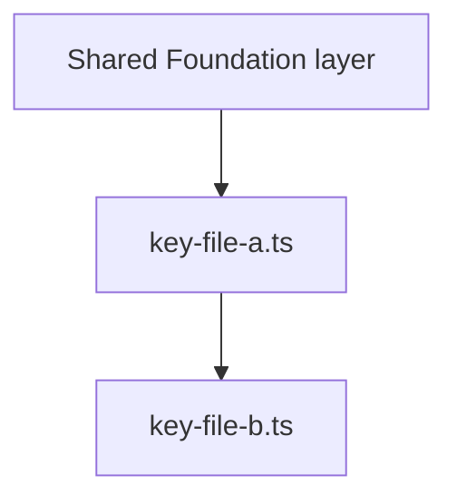

# PR Splitter — Feature-Batch Model

Break down a large committed branch into **feature batches** — one batch per
user-facing feature, each batch containing 2-4 small PRs. The goal: a reviewer
can approve a few PRs per day, merge them, and immediately have a functional
slice of the app — even while other feature batches are still pending.

## Why This Matters

Large PRs don't get reviewed — they get rubber-stamped. A 2000-line PR takes
days to review, catches fewer bugs, and blocks everyone downstream. Splitting
by feature (not by file type) means each batch is independently testable and
each PR has a clear narrative a reviewer can follow in 15-20 minutes.

**The model:**
- **Boilerplate PR**: config, CI/CD, lock files, IDE config. No LOC limit.
- **Shared Foundation (optional)**: types and utilities imported by 2+ batches. ~500-700 lines (excluding tests).
- **Feature Batches**: one batch per feature, branching independently. ~500-700 lines per PR (excluding tests), hard ceiling ~1000.
- **Integration PR (last)**: app entry point, router, global providers.

When all PRs in a feature batch are merged, that feature is independently
testable end-to-end.

---

## Step 0: Prerequisites Check & Project Context Detection

**Prerequisites:**

1. `gh auth status` — confirm the GitHub CLI is authenticated. If not, stop and instruct the user to run `gh auth login`.
2. `git status` — confirm the working tree is clean.
3. Identify the **source branch** (provided by user) and the **ultimate base branch** (e.g., `main`).
4. Confirm the source branch is pushed to remote: `git log --oneline origin/main..HEAD`

**Project context detection (run these and record the results):**

```bash
# Detect repo/project name for branch prefix
git remote get-url origin

# Detect package manager from lock files
git diff --name-only main HEAD | rg "(pnpm-lock|yarn\.lock|package-lock)"

# Detect CI/CD pipelines
git diff --name-only main HEAD | rg "\.github/workflows/"
```

From these results:
- **Branch prefix**: Derive a short prefix from the repo or project name (e.g., `work-package-generator` → `wpg`, `my-api-service` → `api`, `operations-summarizer` → `ops-sum`). Use this prefix for all branch names: `<prefix>/pr1-boilerplate`.
- **Package manager**: `pnpm-lock.yaml` → use `pnpm`; `yarn.lock` → use `yarn`; `package-lock.json` → use `npm`; none found → use `npm` as default.
- **Has deployment pipeline**: If any workflow file matching `cd.yml`, `deploy.yml`, `release.yml`, or similar exists in the diff, set `HAS_CD=true`. This affects PR descriptions (see Step 5).

---

## Step 1: Analyze the Full Diff & Identify Features

### 1a — Get the full file list and line counts

```bash
git diff --stat main HEAD
```

Build an annotated file list with the **counted line total** for each file. Counting rules:
- Lock files, generated files (`*.generated.*`), binaries, and docs are excluded from LOC counts
- Test files (`*.test.*`, `*.spec.*`, `__tests__/`, `*.test-utils.*`) are excluded from LOC counts — they are tracked separately but never count against a PR's LOC budget
- Only additions count (not deletions or whitespace-only changes)
- Lock files always go in the boilerplate PR regardless of size

### 1b — Identify user-facing features

After gathering the file list, read the directory structure to identify distinct user-facing features. Look at:

```bash
# Identify feature areas from pages, features, and component directories
git diff --name-only main HEAD | rg "src/(pages|features|components)/"
```

Group what you find into named features. For example:
- `src/pages/SummaryPage.tsx`, `src/pages/SummaryDetailModal.tsx` → **"Summary" feature**
- `src/pages/TestingPage.tsx`, `src/pages/TestHistoryPage.tsx` → **"Testing" feature**
- `src/pages/Dashboard.tsx` → **"Dashboard" feature**
- `src/features/dashboard-agent/` → part of **"Dashboard" feature**

Record each feature name — these become your batch labels. If a file is shared across multiple features (e.g., a global context, shared hook), it goes in the **Shared Foundation** layer.

---

## Step 2: Group Files into Batches

### Boilerplate PR (PR 1 — no LOC limit)

Place all of the following in PR 1, regardless of total size:
- CI/CD workflows (`.github/workflows/`), build configs (`vite.config.ts`, `tsconfig.json`)
- Package manifests and lock files (`package.json`, `pnpm-lock.yaml`)
- Linter/formatter configs (`biome.json`, `.eslintrc`, `prettier.config.js`)
- Environment templates, container/infra files, IDE configs
- Repository metadata (`.gitignore`, `CODEOWNERS`, `components.json`)
- Test runner config, README/docs, CSS/Tailwind config, `index.html`

The PR description for this batch explicitly tells reviewers which files deserve attention and instructs them to skip the rest.

This PR should make the repo independently buildable and pass CI on its own.

---

### Shared Foundation PR (optional)

Create this PR only if **two or more feature batches** import the same types, utilities, or services. If every type and utility is used by exactly one feature, skip this PR and include those files directly in the relevant feature batch instead.

Files that belong here:
- Global TypeScript type definitions consumed by multiple features
- Pure utility functions with no feature-specific logic, used across features (e.g., `array.ts`, `chunking.ts`, `errorHandling.ts`)
- Shared service clients or SDK wrappers used by multiple features (e.g., a CDF client helper)
- Global CSS / design tokens / theme files used by all UI components
- Shared UI primitives (shadcn/radix components, base button, input, dialog, etc.)
- Global state context providers that coordinate multiple features

Target: ~500-700 counted lines (excluding tests). If the shared layer exceeds 700 lines, sub-split it:
- PR 2a: shared types + pure utility functions
- PR 2b: shared UI primitives + styling
- PR 2c: shared service/API layer + context providers

---

### Feature Batches

For each user-facing feature identified in Step 1b, create a batch. Each batch contains **2-4 PRs** following this structure (skip layers that have no files):

**Batch PR A — Feature Types & Data Layer**
- Feature-specific TypeScript types and interfaces
- CDF query hooks, API calls, data-fetching functions for this feature
- Query key constants for this feature
Target: ~500-700 counted lines (excluding tests).

**Batch PR B — Feature Logic & Utilities**
- Business logic utilities specific to this feature (generation, formatting, calculation)
- Feature-specific state hooks (orchestration hooks that combine data + logic)
- PDF/export utilities if feature-specific
Target: ~500-700 counted lines (excluding tests). If this layer exceeds 700, split along natural boundaries:
  - e.g., data-transformation utils vs. generation/output utils
  - e.g., one hook per file if hooks are large

**Batch PR C — Feature UI & Page**
- Feature-specific components (dialogs, panels, cards)
- The page(s) that compose this feature
- Feature module entry points (`index.ts`)
Target: ~500-700 counted lines (excluding tests). If page files are large, split by component:
  - e.g., one PR per large page component
  - e.g., shared feature components (dialogs, result panels) in one PR, the main page in another

**Batch PR D — Feature Tests (optional)**
- Unit and integration tests for this feature
- Tests never count toward the LOC budget of any PR — include them in the most relevant A/B/C PR unless they are large enough to impair review focus, in which case create a dedicated test PR

**Completeness requirement**: when every PR in the batch has been merged into `main`, a developer must be able to run the app and exercise that feature end-to-end. If the feature depends on the integration PR to be accessible via navigation, state this explicitly in the final batch PR description.

---

### LOC Discipline

1. **Tests are excluded.** Test files (`*.test.*`, `*.spec.*`, `__tests__/`) never count toward a PR's LOC budget. Count only production code.
2. **Target**: ~500-700 counted lines per feature PR (production code only).
3. **If oversize**: look for natural sub-splits within the layer (separate sub-components, split utils by concern).
4. **Exception ceiling**: ~900 lines — if exceeded, the PR description must include the exact count, per-file breakdown, and a concrete reason why further splitting would break compilation or review.
5. **Hard ceiling**: ~1000 lines. Restructure the batch rather than accept a PR this large.
6. **Boilerplate PR is exempt.** Document its contents clearly instead.

---

### Integration PR (last)

The final PR wires all features together:
- App root component (`App.tsx`)
- Main entry point (`main.tsx`)
- Router configuration
- Top-level navigation component (if shared across features)
- Global context providers that span multiple features
- Any remaining shared utilities not captured earlier

Target: ~500-700 counted lines (excluding tests). Accept an exception here if the app's entry point file is inherently large.

---

### CI/CD Ordering Principle

The dependency order is:

```
Boilerplate → Shared Foundation → Feature Batches (independent of each other) → Integration
```

- **Between batches**: feature batches are independent. Batch B does not need to wait for Batch A to merge — they both branch from the same base. Different reviewers can review different batches in parallel.
- **Within a batch**: PRs stack in order (A → B → C → D). PR B branches from PR A because B's logic depends on A's types.
- **Integration PR**: always last; branches from the final merged state of `main` after all batches are in.
- **CD pipeline**: if `HAS_CD=true`, the deployment pipeline must only trigger on merges to `main`. State this in every PR description.

---

## Step 3: Present and Confirm the Strategy

Before executing, present the full proposed plan to the user. Use this table format:

| PR | Branch Name | Base Branch | Batch | Layer | Counted Lines | Functional When? |
|----|-------------|-------------|-------|-------|---------------|-----------------|
| 1 | `<prefix>/pr1-boilerplate` | `main` | Boilerplate | Config, CI/CD, lock files, IDE | uncapped | — |
| 2 | `<prefix>/pr2-shared-types` | `pr1-boilerplate` | Shared Foundation | Global types + pure utils | ~XXX | — |
| 3 | `<prefix>/pr3-shared-ui` | `pr2-shared-types` | Shared Foundation | UI primitives + global styles | ~XXX | — |
| 4 | `<prefix>/pr4-summary-data` | `pr3-shared-ui` | Summary Batch | Feature types + CDF hooks | ~XXX | — |
| 5 | `<prefix>/pr5-summary-logic` | `pr4-summary-data` | Summary Batch | Summary generation + formatting utils | ~XXX | — |
| 6 | `<prefix>/pr6-summary-ui` | `pr5-summary-logic` | Summary Batch | Summary components + page | ~XXX | **Summary feature functional** |
| 7 | `<prefix>/pr7-testing-data` | `pr3-shared-ui` | Testing Batch | Feature types + CDF hooks | ~XXX | — |
| 8 | `<prefix>/pr8-testing-logic` | `pr7-testing-data` | Testing Batch | Testing utils + state hooks | ~XXX | — |
| 9 | `<prefix>/pr9-testing-ui` | `pr8-testing-logic` | Testing Batch | Testing components + pages | ~XXX | **Testing feature functional** |
| 10 | `<prefix>/pr10-integration` | `main` | Integration | App.tsx, main.tsx, router | ~XXX | **Full app functional** |

**Base Branch** = the last shared foundation PR (or boilerplate) for a batch's first PR, then the previous PR within the batch. **Functional When?** = blank except for the final PR in each batch. Note which batches are independent. Also state: detected package manager, branch prefix, `HAS_CD=true/false`.

**Wait for explicit user approval before executing.**

---

## Step 4: Execute the Split

The source branch is never modified. All new branches are cherry-picked from it.

### Pattern A — Boilerplate PR (from `main`)

```bash
git checkout main
git checkout -b <prefix>/pr1-boilerplate

git checkout <source-branch> -- \
  .github/workflows/cd.yml \
  .github/workflows/ci.yml \
  .github/CODEOWNERS \
  .github/renovate.json \
  .gitignore \
  .env.template \
  package.json \
  pnpm-lock.yaml \
  tsconfig.json \
  vite.config.ts \
  biome.json \
  # ... all other boilerplate files

git add .
git commit -m "chore(<prefix>): add project scaffolding, CI/CD, and build config"
git push -u origin <prefix>/pr1-boilerplate
```

### Pattern B — First PR in a new feature batch (branches from shared foundation or boilerplate)

```bash
# Branch from the last shared foundation PR (or boilerplate if no shared layer)
git checkout <prefix>/pr3-shared-ui
git checkout -b <prefix>/pr4-summary-data

git checkout <source-branch> -- \
  src/types/summaryTypes.ts \
  src/hooks/useSummariesCdf.ts \
  src/hooks/cdfQueryKeys.ts

git add .
git commit -m "feat(<prefix>): add Summary feature data layer and CDF hooks"
git push -u origin <prefix>/pr4-summary-data
```

### Pattern C — Subsequent PR within the same batch (stacks on previous batch PR)

```bash
# Branch from the previous PR in this batch
git checkout <prefix>/pr4-summary-data
git checkout -b <prefix>/pr5-summary-logic

git checkout <source-branch> -- \
  src/utils/summaryGenerationCore.ts \
  src/utils/summaryPrompts.ts \
  src/hooks/useSummaryGeneration.ts

git add .
git commit -m "feat(<prefix>): add Summary generation logic and hooks"
git push -u origin <prefix>/pr5-summary-logic
```

### Pattern D — Starting an independent parallel batch

```bash
# A second feature batch also branches from the shared foundation — NOT from the Summary batch
git checkout <prefix>/pr3-shared-ui
git checkout -b <prefix>/pr7-testing-data

git checkout <source-branch> -- \
  src/types/testingTypes.ts \
  src/hooks/useComparisonTest.ts

git add .
git commit -m "feat(<prefix>): add Testing feature data layer"
git push -u origin <prefix>/pr7-testing-data
```

> **Key rule**: Never base a new feature batch on another feature batch's branch. Both batch A and batch B branch from the same shared foundation branch. This keeps batches independent and allows parallel review and merge.

---

## Step 5: Create GitHub Pull Requests

Before writing the PR description, **read the key files being committed to this PR**. Generic descriptions ("adds the data layer") don't help reviewers — describe what the code actually does in this application, naming key functions and components.

After pushing each branch, immediately create its PR:

```bash
gh pr create \
  --base <base-branch> \
  --head <prefix>/prN-<name> \
  --title "<type>(<prefix>): <short description>" \
  --body "$(cat <<'EOF'
## What this PR introduces

<3-8 sentences written after reading the actual files. Explain what the files do, what problem they solve, and why they are grouped together. Name key functions, modules, and components. Do NOT write "this PR adds the data layer" — instead write what the data layer actually does in this application.>

**Batch**: `<Feature Name>` — PR N of M in this batch (e.g., "Summary — PR 2 of 3").

## User-visible outcome

<State what a user will be able to do once the entire batch is merged:>
- If this is the **final PR** in the batch: "After merging this PR, a user can: [specific end-to-end action — e.g., navigate to the Summary page, generate a summary from CDF data, and download it as a PDF]."
- If this is **not** the final PR: "No user-visible change yet — this feature becomes functional when `<prefix>/prN-<final-batch-pr>` is merged."

## Architecture & connections

<Explain how the files in this PR relate to each other AND how they depend on files from previous PRs. Name specific imports. For PRs that introduce structural relationships (data layer, logic layer, UI), include a Mermaid diagram.>



## Notable technology added

<List any packages or tools that appear for the first time in this PR. Omit this section if no new dependencies are introduced.>

| Package | Purpose | Notes |
|---------|---------|-------|
| `example-pkg` | <what it does> | <why chosen, if non-obvious> |

## Architecture decisions

<Document non-obvious technical choices visible in the code you read. Omit this section if there are no decision-worthy choices (e.g., a pure config-files PR).>

## Files to skip in review

<List auto-generated, binary, or documentation-only files. For the boilerplate PR, this section is critical — list every file that is not worth reviewer time.>

| File | Reason |
|------|--------|
| `pnpm-lock.yaml` | Auto-generated lock file — no manual review needed |
| `<filename>` | <Auto-generated / Binary asset / Reference documentation / etc.> |

## JIRA
<!-- Add relevant ticket: https://cognitedata.atlassian.net/browse/XXX-000 -->

## Testing steps
- [ ] CI pipeline passes (lint, type-check, build)
- [ ] <Specific manual test steps. If the feature is not yet functional in this PR, state: "No observable behaviour in this PR — functionality completes in `<branch>`." If this is the final batch PR, provide step-by-step instructions to exercise the feature end-to-end.>

## Notes to reviewer
- **Feature batch**: this is part of the `<Feature Name>` batch (`prA` → `prB` → `prC`). Merge this batch in order: `prA` first, then `prB`, then this PR.
- **Other batches are independent**: the `<Other Feature>` batch can be reviewed and merged in any order relative to this batch.
- **Deployment**: This PR will NOT trigger a deployment. The CD pipeline runs only when a PR merges into `main`. Merging feature batch PRs is safe at any time.
<CONDITIONAL — include only if PR exceeds 700 counted lines (production code, excluding tests):>
- **LOC note**: This PR contains <EXACT_TOTAL> counted lines (production code only; tests and generated/binary/doc files excluded). Breakdown:
  - `<file-name>`: <line-count> lines — <one sentence on why this file cannot be in a separate PR>
  A sub-split was considered but rejected because: <specific concrete reason>.
</CONDITIONAL>

EOF
)"
```

### Special template for the Boilerplate PR

The boilerplate PR uses the same template but with these adjustments:
- **What this PR introduces**: describe the project scaffold — what framework, what build tools, what CI/CD strategy.
- **User-visible outcome**: "This PR establishes the empty project skeleton. No features are functional yet."
- **Architecture & connections**: describe the build pipeline, CI workflow triggers, and any notable config decisions (e.g., why pnpm, why biome over eslint, why vitest).
- **Files to skip in review**: list `pnpm-lock.yaml` and any other auto-generated files explicitly. Tell reviewers the files that ARE worth reviewing (typically `package.json`, CI workflow files, linter/formatter config, `tsconfig.json`).
- **Testing steps**: "CI pipeline passes (build + lint). No manual testing required for this PR."

After each `gh pr create` succeeds, print the returned PR URL for the user.

---

## Step 6: Final Verification

After all PRs are created:

1. Run `gh pr list` to confirm all PRs are open with the correct base branches.

2. Verify the following:
   - Every feature batch has exactly one PR with a non-empty "Functional When?" entry (the final batch PR).
   - Each independent batch's first PR correctly bases off the shared foundation (or boilerplate) — not off another feature batch.
   - The integration PR bases off `main` (it will be rebased after all batches merge).

3. Remind the user:
   - **Parallel review**: feature batches are independent — assign different reviewers to different batches.
   - **Merge order within a batch**: PRs in a batch merge in sequence (A → B → C). GitHub auto-updates the next PR's diff after each merge.
   - **Merge order between batches**: any order, but all batches merge before the integration PR.
   - Add JIRA ticket links and screenshots/recordings for UI-facing PRs.
   - Run lint, format check, and tests before requesting review.
   - Self-review each PR on GitHub before marking ready for peer review.

4. **CI/CD reminder**: If `HAS_CD=true`, confirm the deployment workflow triggers only on `main` pushes. Check the `on:` trigger in the CD workflow file. If it triggers on all branch pushes, warn the team that each batch PR merge may attempt a deploy of an incomplete app.

---

## Step 7: Post-Split Patch Workflow

Use this step when code changes are needed **after** branches have been created — for example, acting on review feedback, Gemini AI review suggestions, or self-review fixes.

### Option A — Small change within a single batch (most common)

1. Identify which branch in the batch owns the file using the strategy table from Step 3.
2. Check out that branch and apply the fix:
   ```bash
   git checkout <prefix>/prN-<name>
   # edit the file(s)
   git add <changed-file>
   git commit -m "fix: <description of review feedback>"
   git push origin <prefix>/prN-<name>
   ```
3. Rebase every **subsequent PR within the same batch** on top of the updated branch:
   ```bash
   git checkout <prefix>/pr(N+1)-<name>
   git rebase <prefix>/prN-<name>
   git push --force-with-lease origin <prefix>/pr(N+1)-<name>
   # Repeat for every subsequent PR in this batch only
   ```
   GitHub will update the PR diffs automatically. **Only PRs in the same batch need rebasing** — PRs in other feature batches are unaffected.

### Option B — Change to a shared foundation file

If a fix touches a file in the Shared Foundation layer:

1. Apply the fix to the shared foundation branch:
   ```bash
   git checkout <prefix>/prN-shared-<name>
   # apply the fix
   git commit -m "fix: <description>"
   git push origin <prefix>/prN-shared-<name>
   ```
2. Rebase **every feature batch's first PR** that branched from this shared branch:
   ```bash
   git checkout <prefix>/pr-<feature-a>-data
   git rebase <prefix>/prN-shared-<name>
   git push --force-with-lease origin <prefix>/pr-<feature-a>-data
   # Then rebase the rest of feature-a's batch in sequence
   # Repeat for feature-b, feature-c, etc.
   ```
   This is the one case where a change cascades across batches. Keep shared foundation changes small to minimise this impact.

### Option C — AI review suggestions on the source branch

Apply each suggestion to the **batch branch that owns that file**, not the source branch. Then rebase subsequent PRs in the same batch (Option A).

### Option D — Large change touching many batches (re-split)

If changes touch files across 3+ batches: apply all changes to the source branch, close existing PRs (`gh pr close <number>`), delete the stacked branches, and re-run the split from scratch.

---

## Gotchas

1. **Never base a feature batch on another feature batch.** Both batches branch
   from the shared foundation (or boilerplate). Basing batch B on batch A creates
   a serial dependency that defeats parallel review.

2. **`git checkout <source> -- <file>` overwrites without merging.** If you've
   already modified a file in the target branch, the checkout replaces it entirely.
   Use `git diff` to verify before checking out files.

3. **Lock files can cause merge conflicts between batches.** If multiple batches
   modify `package.json` (e.g., adding different dependencies), the lock file
   will conflict when the second batch merges. Consolidate all dependency changes
   in the boilerplate PR to avoid this.

4. **Rebasing changes commit hashes.** After `git rebase` + `git push --force-with-lease`,
   existing review comments on GitHub may become outdated. Warn reviewers before
   force-pushing a branch they've already reviewed.

5. **The integration PR should be created last.** It needs to be rebased onto
   `main` after all feature batches have merged, so creating it early just means
   more rebase work later.
