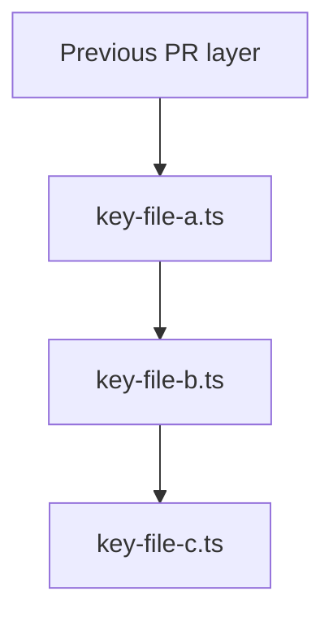

# PR Splitter & Sequencer Skill

You are an expert Git workflow assistant. Your task is to break down a large committed branch into a sequence of stacked Pull Requests on GitHub, grouped by functional domain. Target 5-10 PRs total. The 500-line limit is a real goal, not a suggestion — actively work to keep each PR at or under 500 counted lines. When a functional group exceeds 500 lines, always look for a coherent sub-split before accepting an exception. If a PR must exceed 500 lines because splitting would cause compilation failures or make the PR impossible to review in isolation, include a detailed exception justification with per-file line counts in the PR description (per Cognite's PR guidelines, which allow exceptions when stated).

---

## Step 0: Prerequisites Check & Project Context Detection

**Prerequisites:**

1. `gh auth status` — confirm the GitHub CLI is authenticated. If not, stop and instruct the user to run `gh auth login`.
2. `git status` — confirm the working tree is clean.
3. Identify the **source branch** (provided by user) and the **ultimate base branch** (e.g., `main`).
4. Confirm the source branch is pushed to remote: `git log --oneline origin/main..HEAD`

**Project context detection (run these and record the results):**

```bash
# Detect repo/project name for branch prefix
git remote get-url origin

# Detect package manager from lock files
git diff --name-only main HEAD | grep -E "(pnpm-lock|yarn\.lock|package-lock)"

# Detect CI/CD pipelines
git diff --name-only main HEAD | grep -E "\.github/workflows/"
```

From these results:
- **Branch prefix**: Derive a short prefix from the repo or project name (e.g., `work-package-generator` → `wpg`, `my-api-service` → `api`, `data-pipeline` → `dp`). Use this prefix for all branch names: `<prefix>/pr1-foundation`.
- **Package manager**: `pnpm-lock.yaml` → use `pnpm`; `yarn.lock` → use `yarn`; `package-lock.json` → use `npm`; none found → use `npm` as default.
- **Has deployment pipeline**: If any workflow file matching `cd.yml`, `deploy.yml`, `release.yml`, or similar exists in the diff, set `HAS_CD=true`. This affects PR descriptions (see Step 5).

---

## Step 1: Analyze the Full Diff

Run the following to get a complete picture of all changes:

```bash
git diff --stat main HEAD
```

Then build an annotated file list, noting the **counted line total** for each file. Apply these exclusions from the line count (per Cognite guidelines):

- **Generated code**: any lock files (`pnpm-lock.yaml`, `package-lock.json`, `yarn.lock`), `*.generated.*` files, `dist/`, `build/`, `coverage/`
- **Binary/asset files**: `*.zip`, `*.png`, `*.jpg`, `*.gif`, `*.svg`, `*.ico`, `*.woff`, `*.ttf`, `*.pdf`
- **Documentation only**: `README.md`, `CHANGELOG.md`, `docs/`, `*.md` files that contain no executable code
- **Deleted lines**: only additions count toward the limit
- **Whitespace-only changes**

---

## Step 2: Group Files into Functional PR Groupings

Group changed files by **functional domain**, targeting **5-10 PRs total**. Use the following technology-agnostic categories to classify files from the actual diff. The agent must read the file names and paths and assign them to the appropriate category — do not assume any specific framework or language structure.

**LOC discipline — apply in order:**

1. **Target**: every PR should be at or under 500 counted lines.
2. **First response to oversize**: if a category's files total over 500 counted lines, immediately look for a natural sub-split (e.g., separate data-fetching hooks from AI hooks; split a large API module into retrieval vs. mutation vs. builder). The sub-split must still make functional sense — a reviewer must be able to understand the sub-PR in isolation.
3. **Single-file exception**: if a single file exceeds 500 counted lines by itself (cannot be split without refactoring the source code), accept it as a standalone PR and document the exception with per-file counts.
4. **Absolute ceiling**: if a group exceeds ~800 counted lines and a coherent sub-split exists, the sub-split is mandatory. Only accept a group above ~800 lines when no meaningful split is possible AND the reason is explicitly documented in the PR description.

---

### Functional Categories (apply to any project)

**Category 1 — Project Foundation**
Recognize by: CI/CD workflow files, build tool configs, package manifests, linter/formatter configs, environment templates, IDE/editor configs, containerization files, infrastructure-as-code, lock files (excluded from count), README/docs (excluded from count).
Examples: `.github/workflows/`, `Dockerfile`, `docker-compose.yml`, `package.json`, `pyproject.toml`, `Cargo.toml`, `go.mod`, `.env.template`, `.eslintrc`, `biome.json`, `prettier.config.js`, `tsconfig.json`, `vite.config.ts`, `webpack.config.js`, `.gitignore`.
**This PR must make the repo independently buildable and pass CI on its own.**

**Category 2 — Shared Types, Config & Utilities**
Recognize by: type definition files, shared interfaces/schemas, application config modules, constants, pure helper/utility functions with no framework-specific side effects. These are consumed by every other layer.
Examples: `types.ts`, `*.d.ts`, `schema.py`, `models.go`, `config.ts`, `constants/`, `utils/`, `helpers/`, `lib/`.

**Category 3 — Data Access / API Layer**
Recognize by: files that call external services, APIs, databases, or SDKs. Data-fetching functions, repository classes, ORM models, GraphQL resolvers, REST client wrappers, server actions.
Examples: `api/`, `services/data-*.ts`, `repositories/`, `queries/`, `mutations/`, `prisma/`, `*.repository.ts`, SDK client files.

**Category 4 — State Management & Business Logic**
Recognize by: global state stores, reducers, context providers, orchestration hooks or composables, event handlers that coordinate across the app, service classes that implement business rules.
Examples: `store.ts`, `slice.ts`, `reducer.ts`, `context/`, `hooks/use*.ts`, `composables/`, `*.service.ts`, `*.use-case.ts`.

**Category 5 — UI Primitives, Layout & Styling**
Recognize by: base design-system components with no domain-specific logic, layout shells, navigation scaffolding, global stylesheets, theme files, static assets.
Examples: `components/ui/`, `components/layout/`, `styles/`, `*.css`, `*.scss`, `theme.ts`, `assets/`.

**Category 6 — Feature Components**
Recognize by: domain-specific components, pages, views, screens, or panels that compose the specific feature being introduced. These import from Categories 2–5.
Examples: `components/<feature-name>/`, `pages/<feature-name>.tsx`, `views/`, `screens/`, `features/<name>/`.

**Category 7 — Integration, Entry Point & Tests**
Recognize by: top-level app wiring (root component, router, DI container setup, main entry), integration tests, E2E tests, test fixtures.
Examples: `App.tsx`, `main.ts`, `index.ts` (root), `router.ts`, `*.test.ts`, `*.spec.ts`, `e2e/`, `__tests__/`.

---

### CI/CD Ordering Principle

Order PRs so that each one leaves the codebase in a **buildable, CI-passing state**, even if the feature is not yet functional. The dependency order is always:

```
Foundation → Types/Utils → Data Layer → State/Logic → UI Primitives → Feature Components → Integration/Tests
```

- Never place a file after a PR that depends on it.
- If the project has a deployment pipeline (`HAS_CD=true`), **CD will not trigger until the final PR merges to main**. Intermediate PRs run CI (lint, test, build) only. State this clearly in every PR description.
- If early PRs introduce exported functions or components that nothing yet imports, that is fine — incomplete features are acceptable at intermediate steps as long as CI passes.

---

### Exception Handling

If a PR's counted lines exceed 500 after genuinely attempting a sub-split, the PR description **must** include:
- The exact counted line total
- A per-file breakdown of the top contributors (file name → line count)
- A specific, concrete argument for why splitting further would cause compilation failures or make the PR impossible to review in isolation

Vague statements like "these files belong together" are not sufficient. Name the specific imports or dependencies that make separation impossible.

---

## Step 3: Present and Confirm the Strategy

Before executing, present the full proposed PR sequence to the user as a table:

| PR | Branch Name | Base Branch | Functional Domain | Counted Lines | Exception? |
|----|-------------|-------------|-------------------|---------------|------------|
| 1  | `<prefix>/pr1-foundation` | `main` | Project Foundation | ~XXX | No |
| 2  | `<prefix>/pr2-types-utils` | `<prefix>/pr1-foundation` | Types, Config & Utilities | ~XXX | Yes — cohesive data-shape layer |
| ...| ... | ... | ... | ... | ... |

Include the "Exception?" column so the user can see at a glance which PRs exceed 500 counted lines and will need an exception justification in their GitHub description.

Also state: detected package manager (`<pnpm|yarn|npm>`), branch prefix (`<prefix>`), and whether a deployment pipeline was detected (`HAS_CD=true/false`).

**Wait for explicit user approval before executing.**

---

## Step 4: Execute the Split

Use this workflow for **each PR chunk**. The source branch is never modified — all new branches are created from the base chain.

```bash
# PR 1 — always branches from the ultimate base (e.g. main)
git checkout main
git checkout -b <prefix>/pr1-foundation

# Pull only the files assigned to this PR from the source branch
git checkout <source-branch> -- \
  <path/to/file-1> \
  <path/to/file-2> \
  <path/to/file-3>
  # (use the exact paths from the approved plan table)

git add .
git commit -m "chore: add project foundation, CI/CD, and build config"
git push -u origin <prefix>/pr1-foundation

# PR 2 — branches from PR 1, NOT from main
git checkout <prefix>/pr1-foundation
git checkout -b <prefix>/pr2-types-utils

git checkout <source-branch> -- \
  <path/to/types-file> \
  <path/to/utils-dir/>
  # (use the exact paths from the approved plan table)

git add .
git commit -m "feat: add shared types, config, and utility layer"
git push -u origin <prefix>/pr2-types-utils

# Repeat for each PR chunk, always branching from the PREVIOUS PR's branch
```

> **Critical**: Each PR after the first uses the **previous PR's branch** as its checkout base, not `main`. This keeps individual GitHub PR diffs small and reviewable (reviewers only see what that PR adds on top of the previous one).

---

## Step 5: Create GitHub Pull Requests

Before writing the PR description, **read the key files being committed to this PR** using the Read tool. You must understand what the code actually does in order to write a useful description. Do not write generic placeholder text.

After pushing each branch, immediately create its PR using the GitHub CLI. Use the rich description template below — every section is required unless noted as conditional.

```bash
gh pr create \
  --base <base-branch> \
  --head <prefix>/prN-<name> \
  --title "<type>(<prefix>): <short description of functional group>" \
  --body "$(cat <<'EOF'
## What this PR introduces

<3-8 sentences written after reading the actual files. Explain what the files do, what problem they solve, and why they are grouped together. Be specific — name the key functions, modules, or components and describe their roles. Do NOT write "this PR adds the API layer" — instead write what the API layer actually does in this application.>

This is PR N of TOTAL in a stacked series introducing <feature name>. PRs must be reviewed and merged in order (PR 1 → PR 2 → ... → PR N).

## Architecture & connections

<Explain how the files in this PR relate to each other AND how they depend on files from previous PRs. Name specific imports. For PRs that introduce structural relationships (API layer, state/hooks layer, feature components, page integration), include a Mermaid diagram. Omit the diagram for flat collections of config files or small utilities.>

Example diagram (adapt to the actual code):


## Notable technology added

<List any packages or tools that appear for the first time in this PR. Read package.json to identify which dependencies are first used by the files in this PR. For each entry: name, what it does in this project, and why it was chosen if non-obvious. Omit this section if no new dependencies are introduced.>

| Package | Purpose | Notes |
|---------|---------|-------|
| `example-pkg` | <what it does> | <why chosen, if non-obvious> |

## Architecture decisions

<Document non-obvious technical choices visible in the code you read. Examples: state management library choice and rationale, component library approach, data-fetching pattern, file organisation decisions, API design choices. The agent must infer these from reading the actual code — do not write generic statements. Omit this section if the PR contains no decision-worthy choices (e.g., a pure config-files PR).>

## Files to skip in review

<List any auto-generated, binary, or documentation-only files that are part of this PR but should not consume reviewer time. If no such files exist, omit this section.>

| File | Reason |
|------|--------|
| `<filename>` | <Auto-generated / Binary asset / Reference documentation / etc.> |

## JIRA
<!-- Add relevant ticket: https://cognitedata.atlassian.net/browse/XXX-000 -->

## Testing steps
- [ ] CI pipeline passes (lint, type-check, build)
- [ ] <Specific manual test steps for any observable behaviour introduced by this PR. If the PR introduces no user-visible behaviour yet, state that explicitly: "No observable behaviour in this PR — functionality is completed in PR N.">

## Notes to reviewer
- **Stacked PR series** — merge order: PR 1 → PR 2 → ... → PR N. Each PR targets the previous PR's branch, not main directly. GitHub shows only the net-new diff for this PR.
- **Deployment**: This PR will NOT trigger a deployment on its own. The CD pipeline only runs when the final PR (PR N) is merged into main. Merging earlier PRs in the series is safe.
<CONDITIONAL — include only if PR exceeds 500 counted lines:>
- **LOC exception**: This PR contains <EXACT_TOTAL> counted lines (excluding generated/binary files). Breakdown of largest contributors:
  - `<file-name>`: <line-count> lines — <one sentence on why this file cannot be in a separate PR, naming the specific imports or shared types that make separation cause a compile failure>
  - `<file-name>`: <line-count> lines — <same>
  A sub-split was considered but rejected because: <specific concrete reason — e.g., "file-b.ts imports 12 types from file-a.ts that are not yet exported through an index; separating them would make file-b.ts fail to compile until file-a.ts is merged">.
</CONDITIONAL>

EOF
)"
```

After each `gh pr create` succeeds, print the returned PR URL for the user.

---

## Step 6: Final Verification

After all PRs are created:

1. Run `gh pr list` to confirm all PRs are open with the correct base branches.

2. Remind the user to:
   - Add JIRA ticket links to each PR description.
   - Add screenshots or screen recordings for any UI-facing PRs (required by Cognite's PR guidelines).
   - Run the project's linter and formatter locally before requesting review:
     ```bash
     <package-manager> run lint
     <package-manager> run format:check   # or equivalent
     <package-manager> run test
     ```
     (Use the package manager detected in Step 0.)
   - Self-review each PR on GitHub before marking it ready for peer review.

3. Merge order is strictly **PR 1 → PR 2 → ... → PR N** in sequence. After each merge into its base branch, GitHub will automatically update the next PR's diff. When PR 1 merges to `main`, PR 2's base becomes `main` as well.

4. **CI/CD reminder**: If `HAS_CD=true`, confirm with the team that the deployment workflow is configured to trigger only on pushes/merges to `main` — not on the intermediate stacked branches. Check the `on:` trigger in the CD workflow file. If it triggers on all branch pushes, the team should be aware that each intermediate merge may attempt a deploy of an incomplete feature.

---

## Step 7: Post-Split Patch Workflow

Use this step when code changes are needed **after** the stacked branches have been created — for example, acting on review feedback, AI review suggestions (e.g., Gemini), or self-review fixes.

### Why this is tricky

Stacked branches are point-in-time snapshots. Changes made to the original source branch or to `main` are **not** automatically reflected in the stacked branches. Each stacked branch must be updated explicitly, and every branch that sits on top of the changed one must be rebased forward.

### Option A — Small change to a single file (most common)

1. **Identify which stacked branch owns the file** by checking the strategy table from Step 3.
2. **Check out that branch and make the fix**:
   ```bash
   git checkout <prefix>/prN-<name>
   # edit the file(s)
   git add <changed-file>
   git commit -m "fix: <description of review feedback>"
   git push origin <prefix>/prN-<name>
   ```
3. **Rebase every subsequent branch** in the stack on top of the updated branch:
   ```bash
   git checkout <prefix>/pr(N+1)-<name>
   git rebase <prefix>/prN-<name>
   git push --force-with-lease origin <prefix>/pr(N+1)-<name>

   # Repeat for pr(N+2), pr(N+3), etc. — every branch AFTER the changed one
   ```
   GitHub will automatically update each PR's diff after the force push. Reviewers will see the updated content without losing their existing review comments.

### Option B — Gemini (or other AI) review on the source branch

If the AI tool reviewed the original source branch (e.g., `work-package-prototype`) and produced suggestions:

1. Apply each suggestion by checking out the **stacked branch that owns that file**, not the source branch:
   ```bash
   git checkout <prefix>/prN-<name>   # whichever branch owns the file
   # apply the suggestion
   git add <file>
   git commit -m "fix: apply Gemini suggestion — <summary>"
   git push origin <prefix>/prN-<name>
   ```
2. Rebase all subsequent branches forward as shown in Option A.

If the AI tool reviewed individual **stacked branches**, apply the suggestion directly on that branch and rebase subsequent ones. No source-branch changes are needed.

### Option C — Large change touching many PRs (re-split)

If a code review or AI analysis triggers significant changes that touch files across many stacked branches, it is cleaner to:

1. Apply all changes to the source branch.
2. Close the existing open PRs on GitHub (`gh pr close <number>`).
3. Delete the stacked branches locally and remotely.
4. Re-run the pr-splitter skill from scratch to generate a fresh set of PRs reflecting the updated code.

Use this option when rebasing would require resolving conflicts on 3 or more branches, or when the changes fundamentally alter the grouping logic of the current stack.
