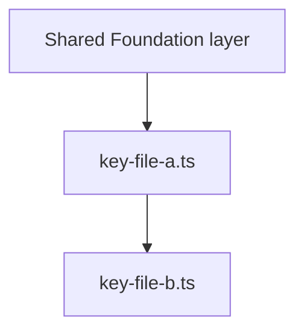

# PR Splitter — Reference

Long-form commands and templates for [SKILL.md](SKILL.md). Read this file when executing the split, composing `gh pr create` bodies, or fixing stacked branches after review.

---

## Cherry-pick patterns

The source branch is never modified. New branches are built by checking out selected paths from the source branch (`git checkout <source-branch> -- <path>…`), then committing and pushing.

### Pattern A — Boilerplate PR (from `main`)

```bash
git checkout main
git checkout -b <prefix>/pr1-boilerplate

git checkout <source-branch> -- \
  .github/workflows/cd.yml \
  .github/workflows/ci.yml \
  .github/CODEOWNERS \
  .github/renovate.json \
  .gitignore \
  .env.template \
  package.json \
  pnpm-lock.yaml \
  tsconfig.json \
  vite.config.ts \
  biome.json \
  # ... all other boilerplate files

git add .
git commit -m "chore(<prefix>): add project scaffolding, CI/CD, and build config"
git push -u origin <prefix>/pr1-boilerplate
```

### Pattern B — First PR in a new feature batch (branches from shared foundation or boilerplate)

```bash
# Branch from the last shared foundation PR (or boilerplate if no shared layer)
git checkout <prefix>/pr3-shared-ui
git checkout -b <prefix>/pr4-summary-data

git checkout <source-branch> -- \
  src/types/summaryTypes.ts \
  src/hooks/useSummariesCdf.ts \
  src/hooks/cdfQueryKeys.ts

git add .
git commit -m "feat(<prefix>): add Summary feature data layer and CDF hooks"
git push -u origin <prefix>/pr4-summary-data
```

### Pattern C — Subsequent PR within the same batch (stacks on previous batch PR)

```bash
# Branch from the previous PR in this batch
git checkout <prefix>/pr4-summary-data
git checkout -b <prefix>/pr5-summary-logic

git checkout <source-branch> -- \
  src/utils/summaryGenerationCore.ts \
  src/utils/summaryPrompts.ts \
  src/hooks/useSummaryGeneration.ts

git add .
git commit -m "feat(<prefix>): add Summary generation logic and hooks"
git push -u origin <prefix>/pr5-summary-logic
```

### Pattern D — Starting an independent parallel batch

```bash
# A second feature batch also branches from the shared foundation — NOT from the Summary batch
git checkout <prefix>/pr3-shared-ui
git checkout -b <prefix>/pr7-testing-data

git checkout <source-branch> -- \
  src/types/testingTypes.ts \
  src/hooks/useComparisonTest.ts

git add .
git commit -m "feat(<prefix>): add Testing feature data layer"
git push -u origin <prefix>/pr7-testing-data
```

> **Key rule**: Never base a new feature batch on another feature batch's branch. Both batch A and batch B branch from the same shared foundation branch. This keeps batches independent and allows parallel review and merge.

---

## GitHub PR body template

Before writing the PR description, **read the key files being committed to this PR**. Generic descriptions ("adds the data layer") don't help reviewers — describe what the code actually does in this application, naming key functions and components.

**Template rule:** Treat `<CONDITIONAL>…</CONDITIONAL>` blocks as authoring instructions only. The text published to GitHub must **not** include those wrapper lines or the instructional sentence inside them — only include the inner markdown (e.g. the bold UI banner or the LOC bullet list) when the condition applies.

The outer fence uses four backticks so a fenced `mermaid` block can appear inside the heredoc body.

````bash
gh pr create \
  --base <base-branch> \
  --head <prefix>/prN-<name> \
  --title "<type>(<prefix>): <short description>" \
  --body "$(cat <<'EOF'
<CONDITIONAL — include only at the very top of the body, before any `##` heading, for PRs that are UI-only or primarily presentational with pre-approved designs. Use a single bold line; substitute the correct design approver. Omit for non-UI PRs. Example:>
**THIS PR ONLY CONTAINS UI CHANGES WHOSE DESIGNS HAVE BEEN APPROVED BY SAM MEDRINGTON**
</CONDITIONAL>

## What this PR introduces

<3-8 sentences written after reading the actual files. Explain what the files do, what problem they solve, and why they are grouped together. Name key functions, modules, and components. Do NOT write "this PR adds the data layer" — instead write what the data layer actually does in this application.>

**Batch**: `<Feature Name>` — PR N of M in this batch (e.g., "Summary — PR 2 of 3").

## User-visible outcome

<State what a user will be able to do once the entire batch is merged:>
- If this is the **final PR** in the batch: "After merging this PR, a user can: [specific end-to-end action — e.g., navigate to the Summary page, generate a summary from CDF data, and download it as a PDF]."
- If this is **not** the final PR: "No user-visible change yet — this feature becomes functional when `<prefix>/prN-<final-batch-pr>` is merged."

## Visual evidence (UI / UX PRs only)

<Omit this entire section for PRs with no user-facing surface. For any PR that changes screens, layout, flows, or copy visible in the app, attach evidence before requesting review — it dramatically reduces back-and-forth.>

**Screenshots** *(paste images or drag into the PR description on GitHub)*

<!-- Screenshot 1: [e.g. main happy path — short caption] -->
<!--  -->

<!-- Screenshot 2: [e.g. empty / error / loading state if applicable] -->
<!--  -->

**Screen recording** *(optional; short Loom / GIF / mp4 for motion, transitions, or multi-step flows)*

<!-- Link or embed, e.g.: [Loom — Summary export flow](https://www.loom.com/share/...) -->
<!-- Or:  -->

**Design reference** *(if applicable: Figma link, ticket, or "matches approved mock" note)*

<!-- [Figma / Jira design ticket / spec] -->

## Architecture & connections

<Explain how the files in this PR relate to each other AND how they depend on files from previous PRs. Name specific imports. For PRs that introduce structural relationships (data layer, logic layer, UI), include a Mermaid diagram.>



## Notable technology added

<List any packages or tools that appear for the first time in this PR. Omit this section if no new dependencies are introduced.>

| Package | Purpose | Notes |
|---------|---------|-------|
| `example-pkg` | <what it does> | <why chosen, if non-obvious> |

## Architecture decisions

<Document non-obvious technical choices visible in the code you read. Omit this section if there are no decision-worthy choices (e.g., a pure config-files PR).>

## Files to skip in review

<List auto-generated, binary, or documentation-only files. For the boilerplate PR, this section is critical — list every file that is not worth reviewer time.>

| File | Reason |
|------|--------|
| `pnpm-lock.yaml` | Auto-generated lock file — no manual review needed |
| `<filename>` | <Auto-generated / Binary asset / Reference documentation / etc.> |

## JIRA
<!-- Add relevant ticket: https://cognitedata.atlassian.net/browse/XXX-000 -->

## Testing steps
- [ ] CI pipeline passes (lint, type-check, build)
- [ ] <Specific manual test steps. If the feature is not yet functional in this PR, state: "No observable behaviour in this PR — functionality completes in `<branch>`." If this is the final batch PR, provide step-by-step instructions to exercise the feature end-to-end.>

## Notes to reviewer
- **Feature batch**: this is part of the `<Feature Name>` batch (`prA` → `prB` → `prC`). Merge this batch in order: `prA` first, then `prB`, then this PR.
- **UI-only / ViewModel split**: if this PR is UI-focused and prior batch PRs already introduced ViewModels/hooks, say so explicitly (e.g. "No new business logic — components bind to existing hooks from `<branch>`."). That signals a faster review path.
- **Other batches are independent**: the `<Other Feature>` batch can be reviewed and merged in any order relative to this batch.
- **Deployment**: This PR will NOT trigger a deployment. The CD pipeline runs only when a PR merges into `main`. Merging feature batch PRs is safe at any time.
<CONDITIONAL — include only if PR exceeds 700 counted lines (production code, excluding tests):>
- **LOC note**: This PR contains <EXACT_TOTAL> counted lines (production code only; tests and generated/binary/doc files excluded). Breakdown:
  - `<file-name>`: <line-count> lines — <one sentence on why this file cannot be in a separate PR>
  A sub-split was considered but rejected because: <specific concrete reason>.
</CONDITIONAL>

EOF
)"
````

### Special template for the Boilerplate PR

The boilerplate PR uses the same template but with these adjustments:

- **What this PR introduces**: describe the project scaffold — what framework, what build tools, what CI/CD strategy.
- **User-visible outcome**: "This PR establishes the empty project skeleton. No features are functional yet."
- **Visual evidence**: omit the entire section (no UI).
- **UI banner**: do not include the optional top-of-body bold line.
- **Architecture & connections**: describe the build pipeline, CI workflow triggers, and any notable config decisions (e.g., why pnpm, why biome over eslint, why vitest).
- **Files to skip in review**: list `pnpm-lock.yaml` and any other auto-generated files explicitly. Tell reviewers the files that ARE worth reviewing (typically `package.json`, CI workflow files, linter/formatter config, `tsconfig.json`).
- **Testing steps**: "CI pipeline passes (build + lint). No manual testing required for this PR."

### UI-only PRs: banner and evidence (strongly recommended)

For PRs that are **only** layout, styling, composition, or copy (especially when designs were signed off separately), add a **single bold line at the top** of the PR body (before `## What this PR introduces`). GitHub Markdown: wrap the sentence in `**...**`. Teams substitute the correct design owner; one effective example:

**THIS PR ONLY CONTAINS UI CHANGES WHOSE DESIGNS HAVE BEEN APPROVED BY SAM MEDRINGTON**

That line sets reviewer expectations clearly. Combine with the **Visual evidence** section (screenshots and optional short video) so the reviewer can verify pixels without running the branch.

---

## Post-split patch workflow

Use when code changes are needed **after** branches have been created — for example, acting on review feedback, Gemini AI review suggestions, or self-review fixes.

### Option A — Small change within a single batch (most common)

1. Identify which branch in the batch owns the file using the strategy table from Step 3 in SKILL.md.
2. Check out that branch and apply the fix:

   ```bash
   git checkout <prefix>/prN-<name>
   # edit the file(s)
   git add <changed-file>
   git commit -m "fix: <description of review feedback>"
   git push origin <prefix>/prN-<name>
   ```

3. Rebase every **subsequent PR within the same batch** on top of the updated branch:

   ```bash
   git checkout <prefix>/pr(N+1)-<name>
   git rebase <prefix>/prN-<name>
   git push --force-with-lease origin <prefix>/pr(N+1)-<name>
   # Repeat for every subsequent PR in this batch only
   ```

   GitHub will update the PR diffs automatically. **Only PRs in the same batch need rebasing** — PRs in other feature batches are unaffected.

### Option B — Change to a shared foundation file

If a fix touches a file in the Shared Foundation layer:

1. Apply the fix to the shared foundation branch:

   ```bash
   git checkout <prefix>/prN-shared-<name>
   # apply the fix
   git commit -m "fix: <description>"
   git push origin <prefix>/prN-shared-<name>
   ```

2. Rebase **every feature batch's first PR** that branched from this shared branch:

   ```bash
   git checkout <prefix>/pr-<feature-a>-data
   git rebase <prefix>/prN-shared-<name>
   git push --force-with-lease origin <prefix>/pr-<feature-a>-data
   # Then rebase the rest of feature-a's batch in sequence
   # Repeat for feature-b, feature-c, etc.
   ```

   This is the one case where a change cascades across batches. Keep shared foundation changes small to minimise this impact.

### Option C — AI review suggestions on the source branch

Apply each suggestion to the **batch branch that owns that file**, not the source branch. Then rebase subsequent PRs in the same batch (Option A).

### Option D — Large change touching many batches (re-split)

If changes touch files across 3+ batches: apply all changes to the source branch, close existing PRs (`gh pr close <number>`), delete the stacked branches, and re-run the split from scratch.
